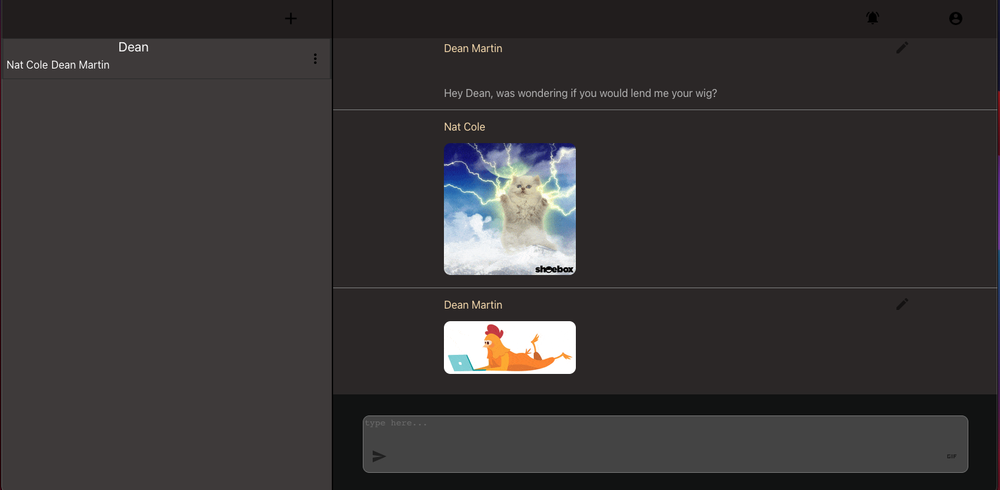
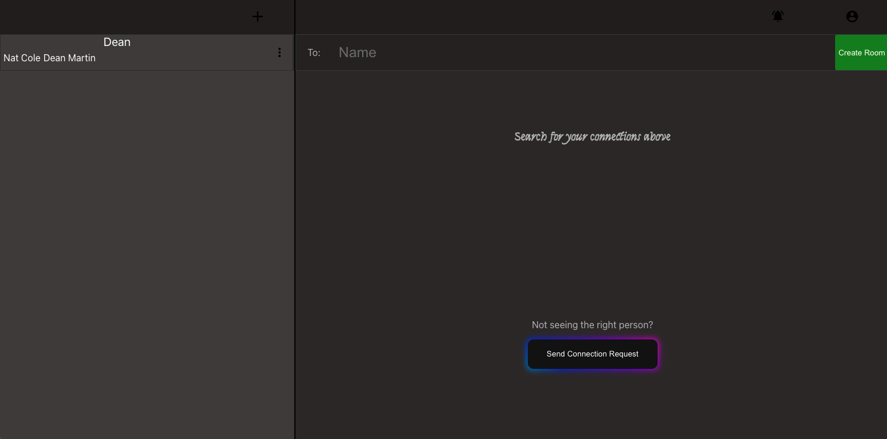

  # Emissary
  
  <a href="https://foreign-emissary.herokuapp.com/">Deployed</a>

  ## Description

  My third and best attempt at building a chat application. This is a normal chat application where you can send, receive, edit, and delete messages. You can send and recieve friend requests as well. When you first create an account and loggin, you are greated with a short intro as to what certain buttons do. You can also recieve notifications when your friend requests are accepted.

  ## Images

  ## Demo
  <a href="https://watch.screencastify.com/v/DnQWPYGtjeec5YuW2fXw">Video Demo</a>
  
  ## Table of Content

  * [Installation](#installation)

  * [Usage](#usage)

  * [License](#license)

  * [Contributing](#contributors)

  * [Contact](#questions/contact)

  ## Installation

  To Install necessary dependencies, run the following command:
  
  In the root repo run "npm i" and in the client repo run "npm i".

  ## Usage

      Follow the instructions after you first log in.
  
  ## Technologies

      npm packages include, socket.io, express, cors, bcrypt, jsonwebtoken, mysql2, nanoid, sequelize, @reduxjs/toolkit, axios, react-redux, react-router-dom, socket.io-client. Foundation Technologies: Javascript and React

  ## Contributors

  Benjamin Hopkins

  ## Questions/Contact

  <a href="https://github.com/bh007183">GitHub Profile</a>
  <a href="mailto:bjhops17@gmail.com"> Email Me</a>

  ## Learning

  This was my third attemped at building a chat application. There are alot of glitches in it still as you will see in the video link if you choose to watch the demo. For me, all of the moving parts in a chat application was really interesting to try and get. One challenge for me was trying to think about my code backwords from the recipients perspective. Normally when building an app your focassed on the actual user. Its different if there are two users sharing a socket at the same time and communicating with each other. That was a great learning oportunity as well as the oportunity to learn how to better utilize socket.io. 

  ## Should Haves

  Should have had better error notifications for the user. As of now there are basically none. 
  Should have made it mobile friendly.
  Should have written better documentation in my code.

  ## Unresolved Glitches

  User does not get notification of friend request if the are not logged in at time of request....obviously a huge flaw.
  User sometimes has to refresh page to get their message edit capabilities.
  Seems to be some connectivity issues

  ## Summary

  In Summary, I learned the importance of building an MVP first and then adding the goodies and though the project is far from perfect or complete, I am proud of what I learned.
  
  

  
